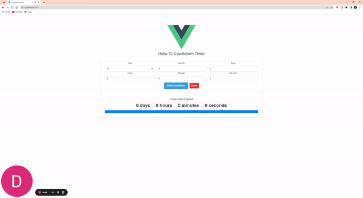

# Learning Vue.js through Countdown Timer Component

## Table of Contents

1. **Introduction**
   - Learning Journey
   - Key Concepts Explored

2. **Component Overview**
   - Building Blocks of the Component
   - User Interaction Elements

3. **Understanding Functionality**
   - Starting the Countdown Logic
   - Resetting the Countdown
   - Dynamic Time Display

4. **Exploring Styling**
   - Component Styling Techniques
   - Creating Visual Appeal

5. **Code Breakdown**
   - Deconstructing the Template
   - Comprehending the Script
   - Styling with SCSS

6. **Application in Real Projects**
   - Integrating the Component
   - Adapting for Different Use Cases

7. **Reflecting on Learning Journey**

## 1. Introduction

### Learning Journey

As I embarked on my Vue.js learning journey, I came across an exciting project opportunity – building a Countdown Timer Component. This project turned out to be an invaluable learning experience, allowing me to grasp core Vue.js concepts and techniques.

### Key Concepts Explored

Throughout this project, I delved into fundamental concepts that form the foundation of Vue.js development:

- **Component-based Architecture**: I learned to structure my application into reusable components, making the codebase organized and maintainable.

- **Data Binding and Two-Way Communication**: Vue's data binding and `v-model` directive enabled me to seamlessly connect user input with data properties, facilitating real-time updates.

- **Computed Properties**: I discovered how to efficiently calculate derived data using computed properties, improving performance by avoiding unnecessary re-computations.

- **Lifecycle Hooks**: Exploring lifecycle hooks like `mounted` and understanding when to trigger certain actions was pivotal to controlling the flow of the application.

## 2. Component Overview

### Building Blocks of the Component

Through the Countdown Timer Component, I learned about the significance of breaking down an application into smaller, manageable parts. The template structure divided the interface into distinct sections: the input form and the countdown display. This approach ensured that each part had a specific purpose and made the code easier to comprehend.

### User Interaction Elements

Building the interactive aspect of the component taught me how to handle user input effectively. I learned how to capture user-entered data and trigger functions like starting the countdown and resetting it. This hands-on experience solidified my understanding of Vue's event handling mechanisms.

## 3. Understanding Functionality

### Starting the Countdown Logic

I gained insight into working with timers and intervals. The logic behind initiating the countdown involved utilizing Vue's data properties and methods. Implementing the countdown functionality demonstrated how Vue's reactivity system updates the UI in response to changing data.

### Resetting the Countdown

The process of resetting the countdown involved not only resetting data properties but also managing the interval timer. This taught me about the importance of clearing timers to prevent memory leaks and unexpected behavior.

### Dynamic Time Display

Calculating and displaying the remaining time dynamically was an exciting challenge. I deepened my understanding of JavaScript's `Date` object and honed my skills in performing calculations and formatting data for presentation.

## 4. Exploring Styling

### Component Styling Techniques

Styling the component provided insights into using CSS and SCSS to create visually appealing interfaces. I grasped the concept of scoped styles in Vue, which prevents style conflicts and ensures encapsulation.

### Creating Visual Appeal

By designing the countdown timer's appearance, I learned about user-centered design principles. Elements like colors, typography, spacing, and visual hierarchy came into play, enhancing the overall user experience.

## 5. Code Breakdown

### Deconstructing the Template

Analyzing the template structure improved my ability to understand and modify Vue templates. The clear separation of form and display sections highlighted the importance of compartmentalization.

### Comprehending the Script

The script section revealed the power of Vue's reactive nature. I understood how data properties, computed properties, and methods worked in harmony to create a functional and dynamic application.

### Styling with SCSS

Working with SCSS expanded my knowledge of CSS preprocessing and introduced me to advanced styling techniques. I learned to create modular and reusable styles, making my code more maintainable.

## 6. Application in Real Projects

### Integrating the Component

Reflecting on how to integrate the Countdown Timer Component into larger projects taught me about component reusability. I learned how to import, register, and use components effectively within a Vue application.

### Adapting for Different Use Cases

Considering how the component could be adapted for various scenarios encouraged me to think beyond the immediate project. This taught me the importance of creating flexible and versatile components.

## 7. Reflecting on Learning Journey

Developing the Countdown Timer Component using Vue.js was an enriching learning journey. From basic concepts like data binding to more advanced topics like computed properties and component reusability, this project deepened my understanding of Vue's capabilities. This hands-on experience has equipped me with practical skills that I can confidently apply to future Vue.js projects, fostering continuous growth in my development journey.
